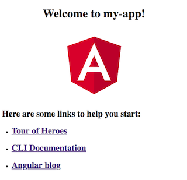

# Getting Started

Angular is a platform that empowers you to build client-side web applications. It comes with a set of great tools/technologies such as two-way data binding, dependency injection, easy-to-use routing, command line tools, reactive programming and etc. It is widely adopted and keeps evolving.

In simple, Angular makes web develoment a fun and easy journey.

## 1 Introduction

You need some tools to develop Angular applications. Most javascript tools require [node.js](https://nodejs.org). Please download the most recent Node.js from [nodejs.org](https://nodejs.org/en/download/).

The recommended IDE for Angular development is [Visual Studio Code](https://code.visualstudio.com/). It has many good built-in features and plugins for Angular development.

Angular uses [TypeScript](https://www.typescriptlang.org/) as its programming language.

> TypeScript is a typed superset of JavaScript that compiles to plain JavaScript.

If you know JavaScript, then it is easy to use TypeScript because all JavaScript code are valid code in TypeScript. In most time, you only need to add some type annotations to your code and you are good to go. The [TypeScript in 5 minutes](https://www.typescriptlang.org/docs/handbook/typescript-in-5-minutes.html) gets you started using TypeScript quickly. Angular suggests to following its [Style Guide](https://angular.io/guide/styleguide) to write Angular code.

Usually you don't start an Angular project from scratch. You use tools to setup a project for you. The Angular CLI is a command line interface tool to crate a project and add different project constructors such as components, pipes, services, modules, etc. It aslo performs tasks such as testing, bundling, and deployment.

## 2 Getting Started

Getting started with Angular is an easy 3-step process.

### Step 1. Install the Angular CLI

Make sure you have Node.js installed and available with commands `node -v` and `npm -v`. Angular nees Node.js version v8.x or greater, npm version 5.x or greater.

Then open a terminal and install the Angular CLI globally with command: `npm install -g @angular/cli`. Use `ng -v` to verify that it is installed successfuly.

### Step 2. Create a new project

Use `ng new my-app` will create a new web project. The project is a client-side application with default settings and a sample home page in a newly-created folder. The folder has the same name as the new project name. The new project name is the string after the `ng new` command. In a real project, you want to change the `my-app` to a more meaningful name.

### Step 3. Run the application

Go to the project folder and run the newly created application.

```sh
cd my-app
ng serve --open
```

The `ng serve` command builds the application and uses the Angular CLI's built-in web server to serve the web application. The `--open` (or `just -o`) option opens a browser (or a browser tab) on `http://localhost:4200/`. The page is similar to the following:



The built-in web server watches project changes and will rebuild the project when there is a change. Use your IDE to open the `my-app` folder, change the title to a different value in the `src/app/app.component.ts` file and see the change in your browser.

```ts
export class AppComponent {
  title = 'My First Angular App!'
}
```

You can also add or change styles in the `src/app.app.component.css` file. Again, changes are reflected in your browser lively.
