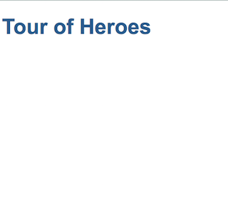

# Chapter 2: The Root Component

## 1 Project Files

The new Angular project is create in a `angular-tour-of-heroes` foler -- the name specified in the `ng new` command. In this folder, the Angular CLI generates several folders and a number of files including source code, enviornment settings, testing and etc.

As a regular Node.js project, the required packages are defined in `package.json` file and all packages are installed in the `node_modules` folder.

Angular CLI creates a local git repository and add a `.gitignore` file that specifies files and folders ignored by git.

You can ignore most files except those in `src` folder when you are a beginner Angular developer.

The built-in web server, started by the `ng serve` command, watches project source code changes and will rebuild the project when there is a change.

## 2 The Root Component

In Angular, a web page are built from one or more components. A component is similar to a native HTML element that has a view and some interactive behaviors. Similar to a typical HTML page, a component usualy consists of three files: an HTML template file, a CSS style file, and a TypeScript code file. A website has a home page and an Angular application has a root component.

Use your IDE to open the `angular-tour-of-heroes` folder. The application source code is in the `src/` folder. The `src/app` folder has the three files for the root component.

- `app.component.ts`: the TS code file that defines the component class.
- `app.component.html`: the HTML template file.
- `app.component.css`: the CSS style file.

The component class file `app.component.ts` defines the data and interaction logic used by the HTML template file.

The `app.component.html` is a standard HTML file that defines the HTML elements and presents data from the component class.

The `app.component.css` is used to define local styles that only affect the view of this component. To define application wide style, use the `src/styles.css` file.

## 3 Changing the Root Component

Just change the title line while keep other lines untouched as the following in `app.component.ts` file.

```ts
//... other lines stay the same
export class AppComponent {
  title = 'Tour of Heroes'
}
```

Replace the content of the `app.component.html` to have the following content:

```html
<h1>{{title}}</h1>
```

The double curly braces in `{{title}}` means that the `title` is a TS expression, evaluate it and display its output in its place. It turns out that `title` is a property of the component class and its value `'Tour of Heroes'` is used as the content of the HTML `h1` tag.

Edit the `src/app/app.component.css` file to have the following styles.

```css
/* Application-wide Styles */
h1 {
  color: #369;
  font-family: Arial, Helvetica, sans-serif;
  font-size: 250%;
}
```

If you keep your browser open, all changes are reflected in your browser lively. You should have the following view:



## 4 The Component Class

The component class file `app.component.ts` has the following content:

```ts
import { Component } from '@angular/core'

@Component({
  selector: 'app-root',
  templateUrl: './app.component.html',
  styleUrls: ['./app.component.css'],
})
export class AppComponent {
  title = 'Tour of Heroes'
}
```

The first line imports `Component` class defined in an Angular package `@angular/core`.

The `@Component({...})` has a special prefix `@` before the class name. It means that the class is a decorator. Decorator is a language feature in TypeScript. A decorator is used to provide metadata to other classes/functions/properties. As shown above, its parameters provide the `selector`, `templateUrl` and `styleUrls` to the `AppComponent`.

The `selector` specifies the html tag for this component to be used. Because this is the root component, it is used in the `src/index.html`. It is not a suprise that the `src/index.html` file only has the `app-root` element in its `<body>` element:

```html
<body>
  <app-root></app-root>
</body>
```

The `templateUrl` points to the html template file of this component. The `styleUrls` points to a list of css files.
