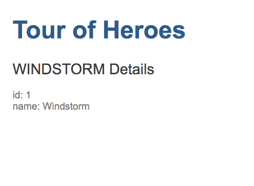
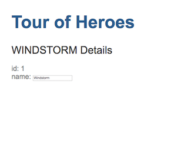

# Chapter 3: Add a New Component

In this chapter, you add a new component that is used by the root component to display and edit detail data of a hero.

## 1 Create the Heros Component

An Angular component usually has three files that work togerther to define a view and its behaviors. To create a new component, it is easier to use the Angular CLI than to create them manually.

Run `ng generate component heroes`, the command create a new folder `src/app/heroes/` and generates four new files in the folder. In addition to the component class file `heroes.component.ts`, html file `heroes.component.html`, and css file `heroes.component.css`, there is a file named `heroes.component.spec.ts`. A file with postfix of `.spec.ts` is a unit test file. You don't use it now and can delete it.

## 2 Create a Hero Class

A class has two properties: `id` and `name`. Create `src/app/hero.ts` file with the following content:

```ts
export class Hero {
  id: number
  name: string
}
```

The `Hero` class and the type information (`number` and `string`) of its properties, thanks to TypeScript, help you to develop application.

## 3 Add and Show a Hero Instance

Change the `src/app/heroes/heroes.component.ts` to have the following content:

```ts
import { Component, OnInit } from '@angular/core'
import { Hero } from '../hero'

@Component({
  selector: 'app-heroes',
  templateUrl: './heroes.component.html',
  styleUrls: ['./heroes.component.css'],
})
export class HeroesComponent implements OnInit {
  hero: Hero = {
    id: 1,
    name: 'Windstorm',
  }

  ngOnInit() {}
}
```

In this component class file, you first import classes/interfaces used by the current component. Then use `@Component({...})` to define meta-data for the component. The `templateUrl` and `styleUrls` are obvious: they point to the HTML template file and the style files. The `selector: 'app-heroes'` meta-data defines the HTML tag name used by other components to include this component in their views. To use it in the root component, edit `Aapp.component.html` to have the following content:

```html
<h1>{{title}}</h1>
<app-heroes></app-heroes>
```

The `HeroesComponent` is used as a new HTML tag and its view will be inserted at the location of `<app-heroes></app-heroes>` element.

The component class creates a `Hero` instance and assign it to the `hero` property. To show the hero object, edit `heroes.component.html` file to thave the following:

```html
<h2>{{hero.name | uppercase}} Details</h2>
<div><span>id: </span>{{hero.id}}</div>
<div><span>name: </span>{{hero.name}}</div>
```

As mentioned in the previous chapter, the content inside the dobule curly braces `{{}}` will be evaluated and its output will be inserted into the HTML element. The above code has an extra `| uppercase` after the `hero.name`. The `|` is a pipe operator that use the value on its left to run the pipe (a special type of Angular function) to transform the value. In this case, it uses the built-in `UppercasePipe` to convert the `hero.name` into uppercase.

Now the page should look like the following:



## 4 Edit the Hero

So far you have a one-way binding from the component class's `hero` property to the HTML template. You may want to edit the hero name in the page and synchronize the change back to the component's `hero` instance -- a two-way binding: change any one and the other one will be changed.

Two-way binding is a big feature of Angular and it is not a surprise that it is pretty easy, just change the `name` part of the HTML template of the `heroes.component.html` as the following:

```html
<div>
  <label>name:
    <input [(ngModel)]="hero.name" placeholder="name">
  </label>
</div>
```

The `[(ngModel)]` binds the `<input>` element value with the `hero.name` instance property, in both direction.

However, when you save the file, the web page goes blank because there is an error in the updated code. In Chrome, use the dev tools to check the console output, you can see an error message: `Template parse errors: Can't bind to 'ngModel' since it isn't a known property of 'input'.`. It means that Angular doesn't understand the `ngModel`. The reason is that the `ngModel` is defined in another place and needs to be imported into this application.

## Import a Module

Angular uses `module` to organize subsystems of an application. Angular comes with some built-in modules that provide common functions such as HTML form manipulation, http request, routing, and etc. Actually every component needs to be imported and declared in a module before it can be used.

For example, the root component is imported by a module, the so-called root module with a class name `AppModule` define in the `src/app/app.module.ts`. The `HeroesComponent` is also imported and declared. The corresponding code is as the following:

```ts
import { AppComponent } from './app.component'
import { HeroesComponent } from './heroes/heroes.component'

declarations: [
  AppComponent,
  HeroesComponent
],

bootstrap: [AppComponent]
```

The last line `bootstrap: [AppComponent]` in the above code has a special meaning: the `AppComponent` is the first component, the root component, of the applicaiton.

To use components and services from a different module, you need to 1) import the module, and 2) declare it in the `imports` meta-data section, both in the module that uses the components or the services.

The `ngModel` is defined in a module called `FormsModule`. To use it, first import the module in `src/app/app.module.ts`:

`import { FormsModule } from '@angular/forms'; // <-- NgModel define here`

Then declare it as the following: `imports: [BrowserModule, FormsModule]`. The `BrowserModule` provides some common functions to Angular and is imported/declared by Angular CLI by default.

After the change, the `app.module.ts` has the following content:

```ts
import { BrowserModule } from '@angular/platform-browser'
import { NgModule } from '@angular/core'
import { FormsModule } from '@angular/forms'

import { AppComponent } from './app.component'
import { HeroesComponent } from './heroes/heroes.component'

@NgModule({
  declarations: [AppComponent, HeroesComponent],
  imports: [BrowserModule, FormsModule],
  providers: [],
  bootstrap: [AppComponent],
})
export class AppModule {}
```

The `NgModule` is another decorator that provides metadata for an Angular module.

Now the page should look like the following:


