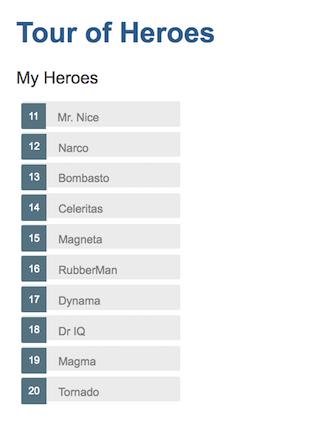

# Chapter 4: Display a List

In the previous chapter, the `HeroesCompont` only display a single hero. As its name suggests, a list of heroes should be displayed.

## 1 Add a List of Mock Heroes

Create a TS file `src/app/mock-heroes.ts` to export a list of heroes as the following:

```ts
import { Hero } from './hero'

export const HEROES: Hero[] = [
  { id: 11, name: 'Mr. Nice' },
  { id: 12, name: 'Narco' },
  { id: 13, name: 'Bombasto' },
  { id: 14, name: 'Celeritas' },
  { id: 15, name: 'Magneta' },
  { id: 16, name: 'RubberMan' },
  { id: 17, name: 'Dynama' },
  { id: 18, name: 'Dr IQ' },
  { id: 19, name: 'Magma' },
  { id: 20, name: 'Tornado' },
]
```

## 2 Display a List of Heroes

First, import the exported list of heroes into the `HeroesComponent` and assign a class property. Edit the `heroes.component.ts` file to have the following two statements.

```ts
import { HEROES } from '../mock-heroes'

export class HeroesComponent implements OnInit {
  heroes = HEROES
}
```

Please remove the old `hero` property and the initial `Hero` object.

In html, the `<ul>` and `<li>` are used to display an unordered list of items. Angular uses `*ngFor` to create repeated `<li>` elements for a list of items. Change the `heroes.component.html` to have the following content:

```html
<h2>My Heroes</h2>
<ul class="heroes">
  <li *ngFor="let hero of heroes"><span class="badge">{{hero.id}}</span> {{hero.name}}</li>
</ul>
```

Similar to JavaScript `for` statement, the `*ngFor` create a `<li>` element for each hero in the list of hereos. `ngFor` is a an Angular directive. A directive, like a component, add some functions to the html template like repeatation, condition and more.

The prefix `*` in `*ngFor` means that this directive changes the html DOM structure -- it repeatly adds elements to the current page.

## Add Local Styles

In Angular, the steyles defined in a component's style file -- specified by the `styleUrls` meta-data in the component clas file only affect this component and its children. Edit the `heroes.component.css` file to have the following content:

```css
/* HeroesComponent's private CSS styles */
.selected {
  background-color: #cfd8dc !important;
  color: white;
}
.heroes {
  margin: 0 0 2em 0;
  list-style-type: none;
  padding: 0;
  width: 15em;
}
.heroes li {
  cursor: pointer;
  position: relative;
  left: 0;
  background-color: #eee;
  margin: 0.5em;
  padding: 0.3em 0;
  height: 1.6em;
  border-radius: 4px;
}
.heroes li.selected:hover {
  background-color: #bbd8dc !important;
  color: white;
}
.heroes li:hover {
  color: #607d8b;
  background-color: #ddd;
  left: 0.1em;
}
.heroes .text {
  position: relative;
  top: -3px;
}
.heroes .badge {
  display: inline-block;
  font-size: small;
  color: white;
  padding: 0.8em 0.7em 0 0.7em;
  background-color: #607d8b;
  line-height: 1em;
  position: relative;
  left: -1px;
  top: -4px;
  height: 1.8em;
  margin-right: 0.8em;
  border-radius: 4px 0 0 4px;
}
```

Now the page should look like the following:



## 3 Master/Detail

It is a common user operation to click an item in a list to display the details of the item. You need to listen to the click event and display the details of a hero is it is clicked.

It is easy to add event listener in Angular. Just change one line in the html template file as: `<li *ngFor="let hero of heroes" (click)="onSelect(hero)">`. It means that if a list item is clicked, the `onSelect()` component class method is called with an argument of the selected `hero`. The parenthesis `()` round the event name of `click` defines a event listener.

To save the selected hero in the component, add the following lines to the component class file `heroes.component.ts`, inside its class definition:

```ts
selectedHero: Hero
onSelect(hero: Hero): void {
  this.selectedHero = hero
}
```

To display the selected hero, add the following line after the list of heroes (i.e., after the `<ul>` elment) in the `heroes.component.html` file:

```html
<h2>{{selectedHero.name | uppercase}} Details</h2>
<div><span>id: </span>{{selectedHero.id}}</div>
<div>
  <label>name: <input [(ngModel)]="selectedHero.name" placeholder="name" /> </label>
</div>
```

When you save the code and check console of the web page, there is an error message `TypeError: Cannot read property 'name' of undefined`. When you click a list item, though not displayed correctly, everything becomes fine. The reason is that when the page is loaded, the `selectedHero` is undefined. It is a type error to access a property of an undefined object.

To fix this bug, you need the `*ngIf` directive. Again, the `*` prefix means that this directive may change the DOM structure. The `*ngIf` evaluates its value and display the element if the result is `true`, otherwise, the elment is not added to the DOM. Please change the details section of the html template as the following:

```html
<div *ngIf="selectedHero">
  <h2>{{selectedHero.name | uppercase}} Details</h2>
  <div><span>id: </span>{{selectedHero.id}}</div>
  <div>
    <label>name: <input [(ngModel)]="selectedHero.name" placeholder="name" /> </label>
  </div>
</div>
```

## Style the Selected Hero

Now it is not clear which hero is the selected in the list. To give it a different style, use the syntax `[class.some-css-class]="some-condition"`. When the `some-condition` is `true`, Angular adds `some-css-class` class to the corresponding element.

In this case, you want to add a `selected` class to the currently selected hero. The `selected` class style is defined in the local css file `heros.component.css`. Change the html `<li>` item in `heros.component.html` as the the following:

```html
<li *ngFor="let hero of heroes" [class.selected]="hero === selectedHero" (click)="onSelect(hero)">
  <span class="badge">{{hero.id}}</span> {{hero.name}}
</li>
```

Now the page should look like the following:


