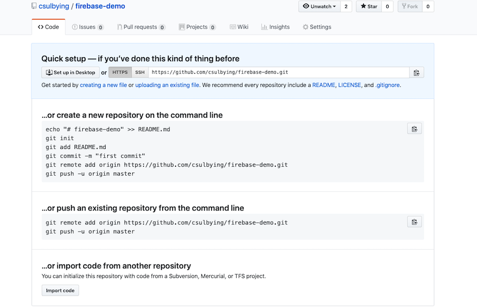

# Firebase CRUD Demo Application

This chapter gives a step-by-step tutorial on creating a CRUD (Create, Read, Update, Delete) web application using Angular 7 and Firebase. [Firebase](https://firebase.google.com/) is a Backen-as-a-service (BaaS) that provides many functions such as authentication/storage/tracing etc for web and mobile application development.

## 1 Setup Firebase

First create an account in Firebase. It has a free plan that is enough for learning purpose. Go to the [Firebase console](https://firebase.google.com/), click `Add project`, give it a name such as `is445-demo-1127` (feel free to use whatever name you like), uncheck the Google Analytics option, click `Countinue` and click `Create Project` in the following page. Firebase will create your project in less than a minute.

Click the `Database` on the left menu and click `Create database`.

Click the `Start in test mode` and click `Enable`.

Click `Add Collection` button to add a new collection with a name of `books`.

And add three strin fields: `author`, `description` and `title`. Click the `Save` button.

Now the data should have a `books` collection with three fields.

## 2 Init Angular Project

First create an empty github project (no README, no license) using any name you like. In my case, it is [firebase-demo](https://github.com/csulbying/firebase-demo).

Then in your computer create a new Angular project using `ng new firebase-demo`. Just press `Enter` to accept the default options.

Run `cd firebase-demo` to go to the newly created project folder and run `ng serve -o` to test that it runs as expected. If it works, commit the changes using command `git commit -am

Then run `git remote add origin your-repository-path` to set the remote repository as the new repository you just created. Make sure to use your repository path, in my case it's `https://github.com/csulbying/firebase-demo.git` as shown in the empty repository picture.

Then commit and push the initial project code using `git push -u origin master`.
